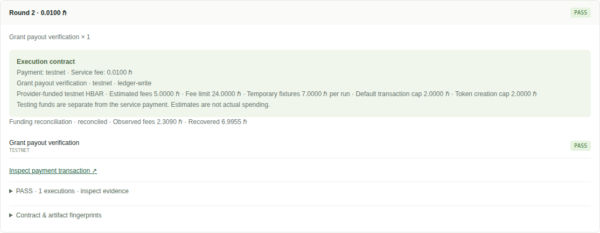

# Hedera Lab

**Verify what an agent-built application actually does on Hedera.**

A green test suite or a “payment complete” screen does not prove that the right
account received the right amount. Hedera Lab runs application scenarios, checks
ledger outcomes independently, and gives coding agents concrete findings to repair.

Use the bundled agent skill to generate verification files from your requirements,
then run local checks, inspect evidence and repair the application. An optional
x402 service adds paid verification through provider-registered packages.

[Get started](#try-it-in-two-minutes) · [Bring your app](docs/onboarding.md) ·
[Architecture](docs/architecture.md) · [Results](docs/results.md)

## Try it in two minutes

Requires Node.js 24 and npm. No wallet, Docker, or model account is needed for this example.

```sh
git clone https://github.com/parthg1901/hedera-lab.git
cd hedera-lab
npm ci
npm run build
node dist/index.js lab run examples/lab-ticketing/scenarios/ledger.yaml
```

The command prints **PASS**, a `simulated` label, and an HTML report you can open.
The repository currently requires access; anonymous cloning will work after publication.

For your own JavaScript payout application:

```sh
node dist/index.js lab onboard init --workspace /path/to/your-app
```

The wizard finds candidate functions and inputs, asks for approved recipient
amounts, generates the verification files, and runs a free simulation. It supports
HBAR payout functions; other application shapes need an adapter.

[Full quick start](docs/quickstart.md) · [Onboarding guide](docs/onboarding.md)

## Let your coding agent add verification

Give your agent the bundled [Hedera Lab skill](skills/hedera-lab/SKILL.md):

> Read `skills/hedera-lab/SKILL.md`. Connect my application to Hedera Lab, generate
> the verification files from my requirements, and run the local checks.

The skill guides payout onboarding, custom NFT/HCS plans and browser integration.
Copy the complete `skills/hedera-lab` folder into your agent's supported skill
location for native discovery, or point it directly at `SKILL.md`. Native skill
loading varies by agent; this is not an automatically installed plugin.

## What you can do

| Capability | What it checks |
| --- | --- |
| Application verification | Approved HBAR amounts, NFT ownership, token association and HCS messages |
| Browser scenarios | Connect actual UI actions to independent ledger assertions |
| Failure and recovery testing | Delayed indexing, retries, concurrency and uncertain transaction outcomes |
| Agent repair | Feed stable findings into the Harness generation/checkpoint/repair lifecycle |
| Network execution | In-memory simulation, Hedera testnet and a configured Solo network |
| Paid verification | Quote required coverage, enforce budgets, settle through Blocky402 and deliver evidence |
| Mainnet preflight | Read-only verification of the registered approval use case; no mainnet writes |

## Optional: paid verification with x402

The paid path is implemented and tested on a **private testnet deployment**. It is
not required for local verification or use of the skill. No public service endpoint
is offered; operators can deploy their own registered verification service.



*Actual result from our private testnet deployment. Public hosting is not yet available.*

```mermaid
flowchart LR
    User[Requirements and budget] --> Agent[Purchasing agent]
    Agent -->|Quote and x402 payment| Service[Verification service]
    Service --> Worker[Isolated testnet worker]
    Worker --> Ledger[Hedera and mirror evidence]
    Ledger --> Report[Assertions and cost report]
    Report --> Repair[Review, repair and retest]
```




The customer signs the service payment locally. A separate worker funds disposable
test accounts, executes registered checks, and reports actual fees and cleanup.
Service payment and testing exposure have separate limits. The dashboard displays
contracts, results and payment evidence.

[Architecture](docs/architecture.md#optional-x402-service) ·
[Payment API and agent setup](docs/verification/README.md) ·
[Container deployment](deploy/verification/WORKER.md)

Try the dashboard with simulated payments:

```sh
npm run verify:serve -- --config examples/verification/payment-catalog.json
```

Open **http://localhost:4318** and follow the [dashboard walkthrough](docs/quickstart.md#2-use-the-dashboard-without-paying-on-chain).

## What we demonstrated

- **Assisted onboarding:** a separate payout example reached its first simulated
  verification with no handwritten Lab files.
- **Real network recovery:** testnet and Solo runs recovered original receipts
  after restarts without submitting another business transaction in the tested cases.
- **Optional paid repair:** GrantFlow passed its four ordinary tests while paying
  the wrong recipient amounts. Private paid testnet verification caught the error;
  a coding agent repaired it, and a second paid run passed. Total service payment:
  0.02 testnet HBAR.

These are bounded demonstrations, not a general agent-accuracy claim. The paid
repair used a controlled defect; the onboarding example was purpose-built.
[Results, limitations and reproduction commands](docs/results.md)

## Project map

```text
src/lab/             Scenarios, adapters, onboarding, assertions and reports
src/verification/    Quotes, payments, dashboard and execution worker
src/preflight/       Read-only mainnet approval checks
examples/            Runnable applications and service configurations
test/                Regression and browser tests
scripts/             Reproducible demos and evaluations
deploy/              Container definitions and deployment guides
docs/                Usage, architecture and technical reference
```

```sh
npm test
npx playwright install --with-deps chromium
npm run test:browser
```

[Technical reference](docs/reference/README.md) · [Deployment](docs/operations/README.md) ·
[Contributing](CONTRIBUTING.md) · [Security](SECURITY.md)

## Scope and origins

Hosted execution currently requires provider-registered applications. Arbitrary
repository uploads and automatic provider onboarding are not implemented. Local
code execution requires trusted code. Solo needs its own installation; a simulator
pass does not establish live-network behavior. See [architecture](docs/architecture.md)
for trust boundaries and recovery limits.

Hedera Lab extends [Hedera Harness](https://github.com/hedera-dev/hedera-harness),
retaining its generation, validation and repair lifecycle. Original upstream Git
history and the [MIT license](LICENSE) are preserved. The package and CLI remain
`hedera-harness` for compatibility.
