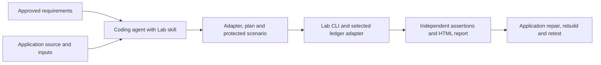
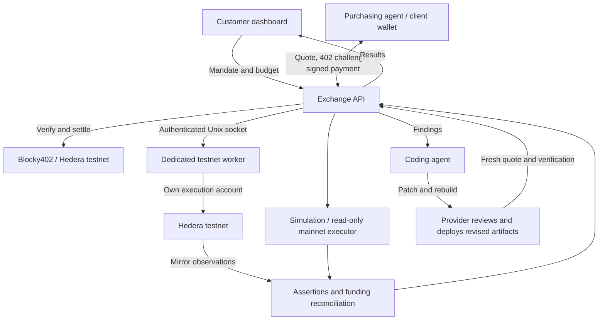

# Architecture

Hedera Lab extends Hedera Harness's generation, checkpoint, validation and repair
lifecycle. The Lab runner executes scenario contracts; Verifier Exchange adds paid
procurement and evidence delivery. Backend code is TypeScript running on Node.js.

## Local verification and the agent skill

The skill helps a coding agent connect actual application logic to plans or a
browser adapter and write assertions from approved requirements. The runner can
execute those scenarios directly without the Exchange, a payment or a dashboard.

The payout wizard automates a supported subset of this integration. Local app
execution requires trusted code; the skill does not add a sandbox or unsupported
ledger operations. Simulation, configured Solo and testnet have distinct evidence
labels. Live execution still needs its own network configuration and authorization.

## Optional x402 service

Verifier Exchange adds procurement and managed execution to the runner. Real
payment and execution were tested on a private testnet deployment. A public
endpoint is not offered, and this service is not required for the local workflow.

## Components and source map

| Path | Responsibility |
| --- | --- |
| `skills/hedera-lab/` | Portable agent instructions for generating and validating application integrations |
| `src/lab/onboard.ts` | Local payout discovery, adapter generation, reviewed expectations and simulation; no automatic provider registration |
| `src/lab/plan.ts` | Strict inert plan loading; app output is validated before any fixtures are funded |
| `src/lab/` | Scenario schema, fixtures, SDK/simulated adapters, browser bridge, assertions and reports |
| `src/verification/` | Catalogs, mandates, quotations, payment, durable jobs, purchasing agent, API and dashboard |
| `src/verification/worker.ts` | Authenticated execution service, funded reservations and worker job state |
| `src/verification/remote-executor.ts` | API routing and retrieval of idempotent remote results |
| `src/preflight/` | Registered mainnet approval policy, call simulation and evidence |
| Remaining `src/` modules | Inherited Harness generation, checkpoint, validation and repair workflow |
| `examples/lab-ticketing/` | Runnable application and protected YAML scenarios |
| `examples/verification/` | Priced catalogs and protocol definitions |
| `test/`, `scripts/` | Regression tests and reproducible evaluation drivers |
| `deploy/verification/` | Container configuration and instance-specific operations |
| `docs/` | Usage, architecture, result summaries and operating procedures |

## Contracts and state

Quotes bind workspace/scenario fingerprints, selection, repetitions, execution
terms and settlement price. A changed artifact cannot silently satisfy an old
contract. Integer tinybar accounting and serialized durable mutations enforce
budgets and job ownership. The single-host store uses exclusive ownership; this is
not a horizontally scaled database or distributed scheduler.

Payment ambiguity and ledger ambiguity are handled separately. The payment path
reconciles the original settlement. Application transaction recovery records intent
and the original transaction ID before submission. Missing evidence does not grant
permission for a new write. See [recovery details](lab/RECOVERY.md).

## Hosted trust boundaries

- API and worker use separate containers, networks and data volumes within the
  dedicated rootless Docker installation. The API binds to host loopback only.
- The worker publishes no TCP port. Its mode-0600 Unix socket is mounted read-only
  in the API, with a separate channel authentication secret.
- The worker signing key is a file mounted only in the worker. The buyer signs in
  the external client. The API customer token authorizes mandates, not wallet access.
- Worker work is limited to trusted registered direct testnet scenarios, including
  bounded JSON plans produced outside the signing process. It rejects
  arbitrary browser/server commands. This is not arbitrary uploaded-code isolation.
- The worker reserves funded capacity before payment settlement and serializes
  execution. Completed results survive restart; in-flight crashes retain uncertainty
  and require operator recovery.

CPU, memory, PID and filesystem restrictions are documented in the [worker guide](../deploy/verification/WORKER.md).
The evidence audit verifies this configuration; it is not a penetration test.

## Interpretation of evidence

A simulated pass only establishes simulator behavior. A live pass records the
network, resources, assertions and transaction evidence. An HCS report anchor
establishes publication/linkage, not the inherent correctness of a verifier. The
mainnet package is a specific approval preflight, not a general mainnet fork engine.
